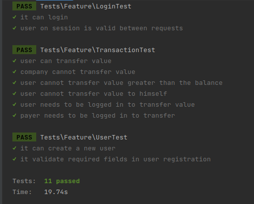

# Banco Simplificado - BACK-END
Este projeto é uma API RESTFul de um "banco simplificado".
A modelagem do Banco de Dados pode ser encontrada em: https://github.com/jilcimar/simplified-bank/blob/main/docs/der.png

## Documentação 🚧
A documentação dos endpoint, pode ser consultada aqui: https://github.com/jilcimar/simplified-bank/tree/main/docs (README).

### Dependências 💻
É necessário ter em sua máquina:
- Docker
- Docker Compose
### Executando o projeto 🔧
Primeiro, copie o arquivo .env.example para o .env do projeto.
```bash
$ cp .env.example .env
```
> Após esse passo, você pode escolher rodar o seu projeto usando o `docker-compose` ou `sail`.
#### Usando docker 🐳
```bash
docker-compose up -d
```

#### Usando Laravel Sail 🌟
É necessário rodar o composer install (raiz do projeto):

```bash 
$ composer install
```

Após a instalação dos packages, é preciso subir os containers do docker.
Para isso, foi usado o [Laravel Sail](https://laravel.com/docs/9.x/sail).
```bash
$ ./vendor/bin/sail up -d
```

Ao executar o comando:
```bash
$ docker ps
```

é para termos os seguintes containers rodando:
- Sail-8.1/app [simplified-bank-laravel.test-1]
- Mysql/mysql-server:8.0 [simplified-bank-mysql-1]
- Redis:alpine [simplified-bank-redis-1]

Agora, entrando no container do "Sail-8.1/app" é só rodar o comando para executar as migrations e os seeds:
```bash
$ php artisan migrate --seed
```

Foram cadastrados 2 usuários para testes, já com saldos nas suas respectivas carteiras.
```
    email: payer@email.com,
    senha: password
```
Tipo Person (pessoa física)

```
    email: payee@email.com,
    senha: password
```
Tipo Company (pessoa jurídica)


> As credenciais do banco são as que estão no seu arquivo .env do projeto.

## Insomia ✨
Para quem usa o [Insomia](https://insomnia.rest/download) ou [Postman](https://www.postman.com/downloads/)
temos essa [collection](https://github.com/jilcimar/simplified-bank/blob/main/docs/collection.json)!

## Testes 🧪

Para executar os testes, é preciso entrar no container da aplicação "Sail-8.1/app [simplified-bank-laravel.test-1]" e executar: 
```bash
./vendor/bin/pest
```

